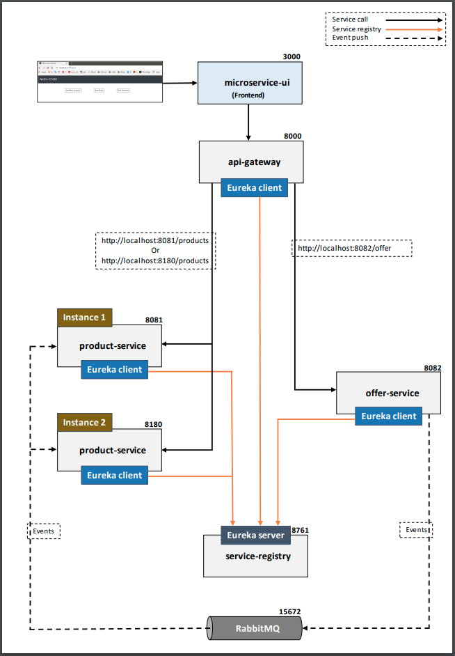

# **🛠️ Projet Microservices**

## Architecture des Microservices

Le microservice est une architecture moderne et populaire utilisée pour concevoir des applications logicielles ces dernières années.

## Principes des Microservices

Une application basée sur les microservices est composée de plusieurs services distincts, où chaque service est :  
- **Déployable indépendamment**  
- **Évolutif indépendamment**  

Ces deux principes sont les exigences fondamentales d'une architecture microservices.

# 📚 Aperçu du Projet

## Structure de l'Application
Dans cette application, nous avons deux services principaux :  
- **product-service**  
- **offer-service**  

Ces deux services sont déployables et évolutifs de manière indépendante. Ils utilisent deux bases de données différentes, bien que cela ne soit pas une obligation dans une architecture microservices. Les deux services pourraient également partager une même base de données si nécessaire.

## Services Complémentaires

Pour exposer ces services et mettre en place une véritable architecture de microservices, deux autres services ont été intégrés :  
- **service-registry** : utilisé pour la découverte des services.  
- **api-gateway** : utilisé pour le routage dynamique des services ainsi que pour l'équilibrage de charge.
- 
## Architecture des Services

## **Service Client (Customer Service)**
- **Langage** : TypeScript / Node.js
- **Base de données** : MongoDB

---

## **Service Produit (Product Service)**
- **Langage** : Java
- **Base de données** : MySQL

---

## **Service Inscription (Register Service)**
- **Langage** : Python
- **Base de données** : PostgreSQL

---

## **Service Offres (Offer Service)**
- **Langage** : C
- **Base de données** : MongoDB

---

## **mservice-ui** (Frontend)
- **Langage** : Angular

## Architecture de l’Application

Voici une représentation de l'architecture de l’application:  

Cette architecture démontre l’intégration de plusieurs services indépendants
qui communiquent entre eux grâce à Istio, offrant ainsi une gestion centralisée du
trafic et une observabilité poussée des interactions.

